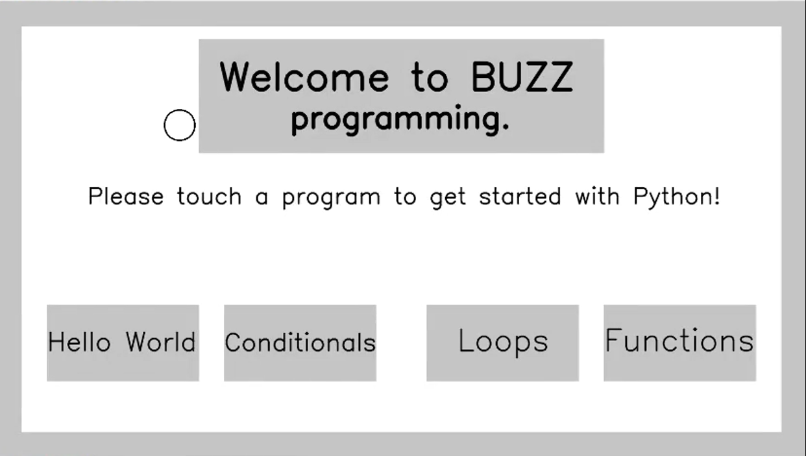
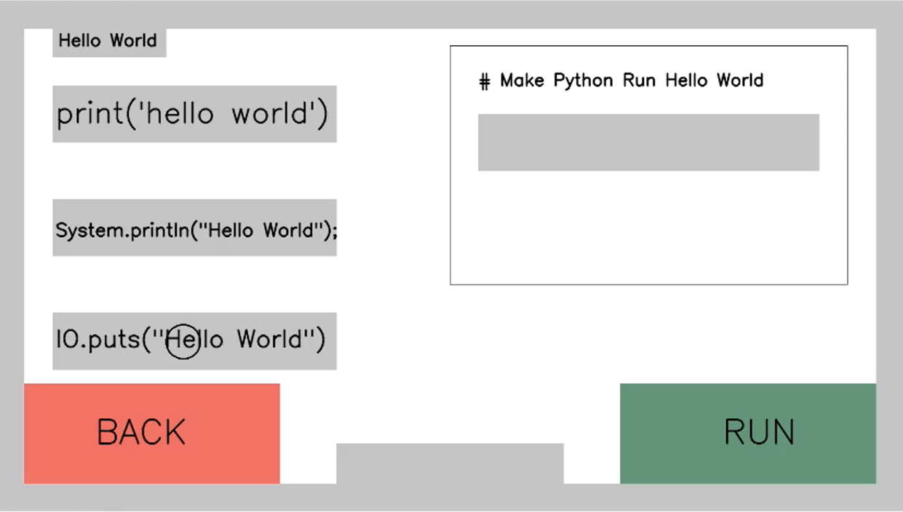
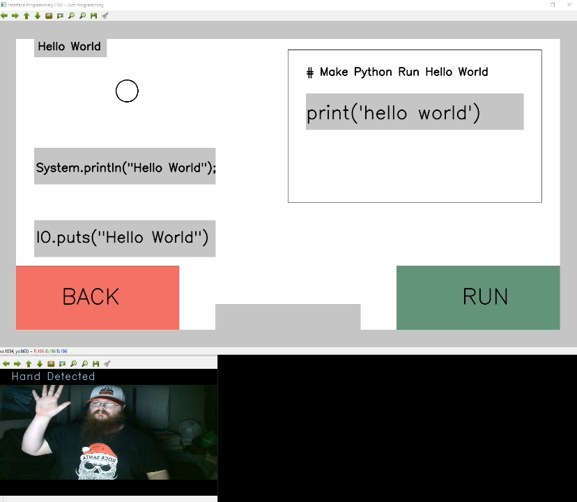

# A simple learning tool made with Python and OpenCV 
This project was developed by a collegue and myself to create a simple application which allows the use of camera input with gestures without the use of a keyboard and mouse.

The premise of this project is to create a simple but interactive learning tool for understanding how python programs work on a concept by concept basis.

This project was completed during the events of COVID-19 in which limited myself and my colleague to work from home on a remote basis.

## Sample Screenshots

**My colleague anthony giving the program a test.**

